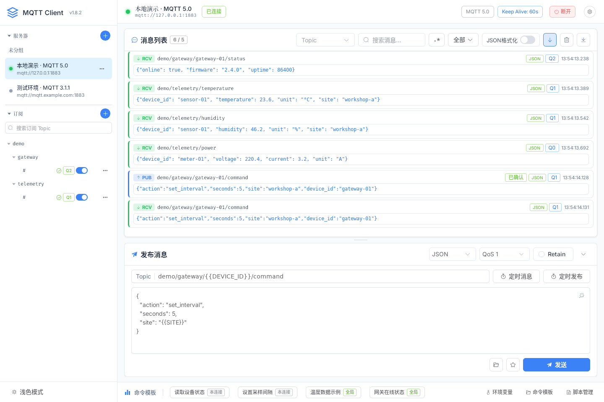
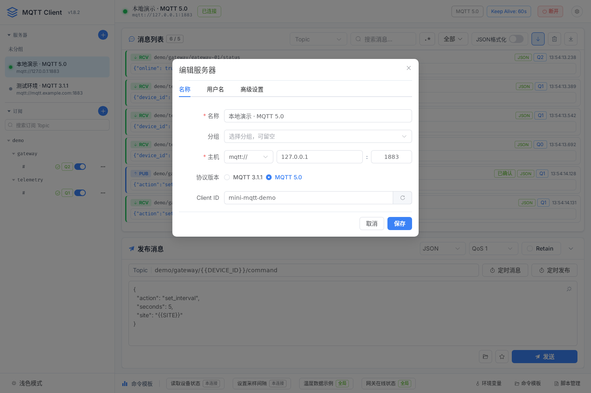
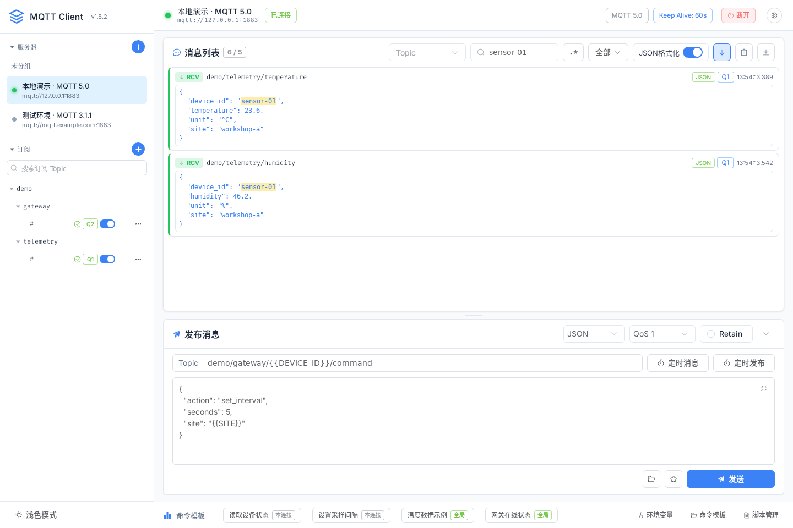
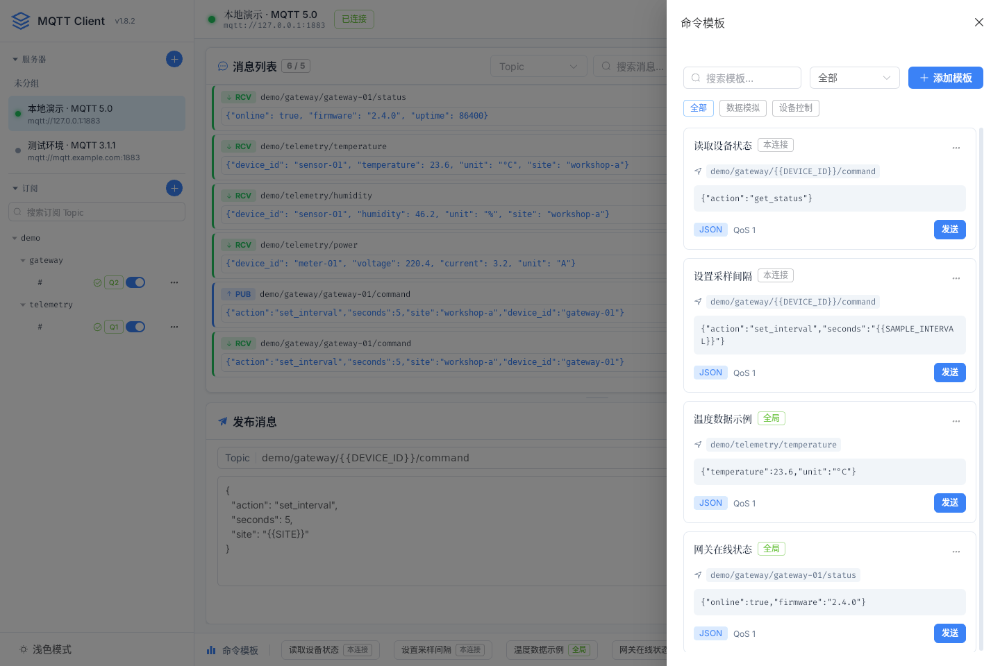
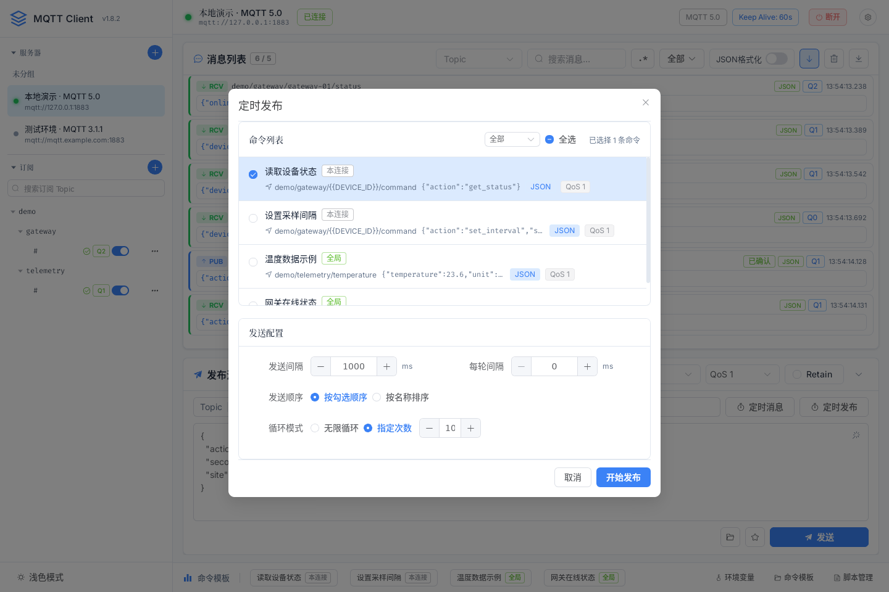
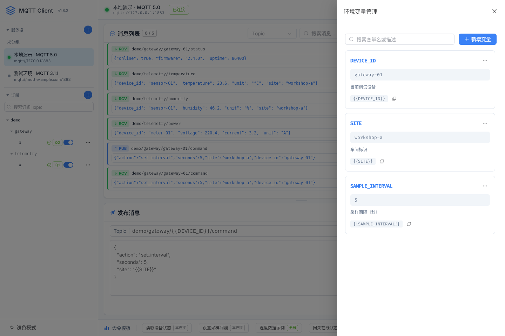
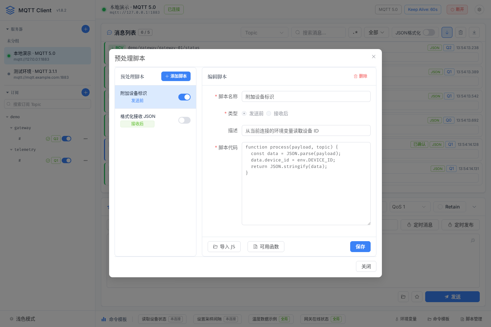
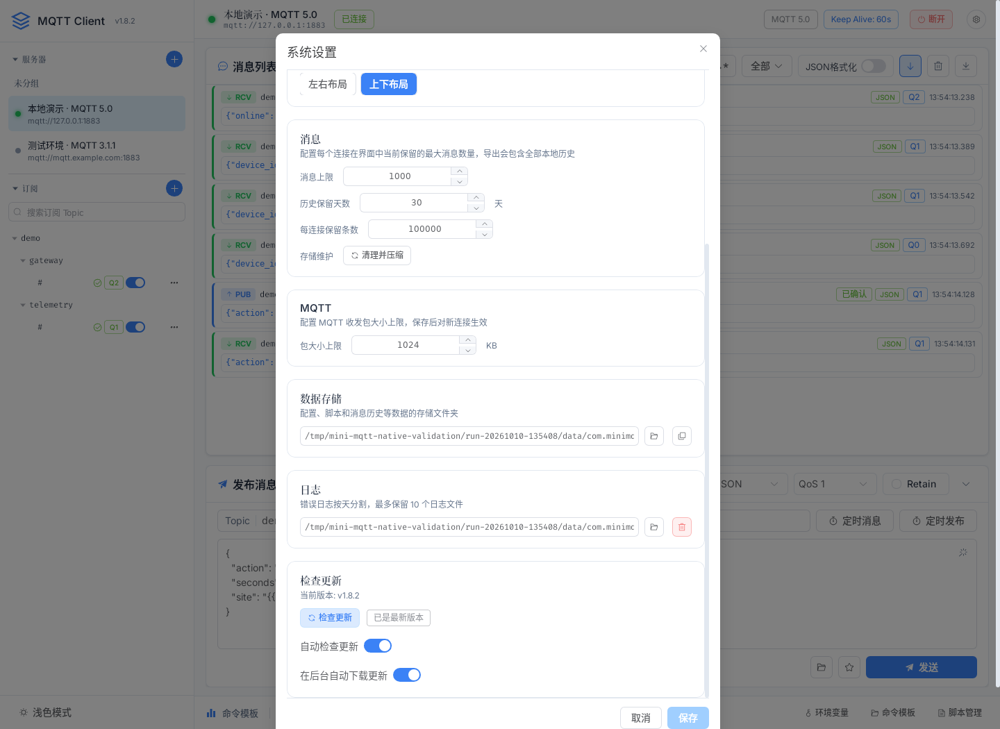
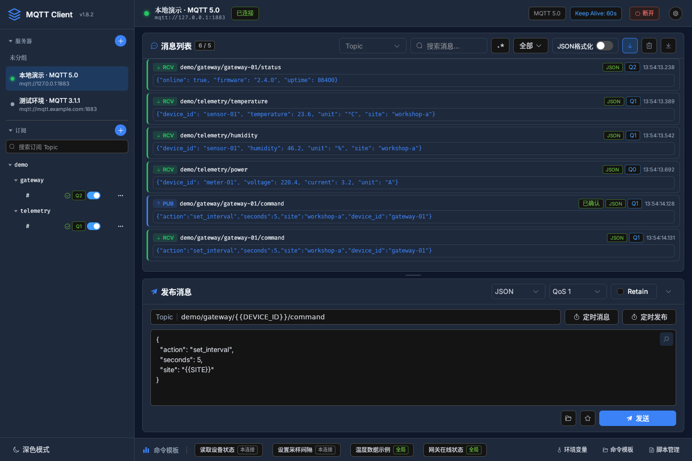

# Mini MQTT Client

基于 Tauri 2 + Vue 3 + Rust 的跨平台 MQTT 桌面调试客户端，支持 Windows、macOS 和 Linux。提供多连接管理、消息收发与历史查询、命令模板、定时发送、环境变量和 JavaScript 预处理脚本。

[下载最新版本](https://github.com/Gerrit1999/mini-mqtt-client/releases/latest) · [更新日志](https://github.com/Gerrit1999/mini-mqtt-client/releases) · [反馈问题](https://github.com/Gerrit1999/mini-mqtt-client/issues)



以下示例图来自 v1.8.2 的 Linux 桌面应用，使用本地 MQTT Broker 和设备演示数据。

## 安装与快速开始

前往 [Releases](https://github.com/Gerrit1999/mini-mqtt-client/releases/latest) 下载对应平台的安装包：

| 平台 | 架构 | 安装包 |
|------|------|--------|
| Windows | x64 | `.exe` / `.msi` |
| macOS | Universal（Apple Silicon / Intel） | `.dmg` |
| Linux | x64 | `.AppImage` / `.deb` / `.rpm` |

1. 准备一个可访问的 MQTT Broker，点击左侧 **服务器** 区域的 `+` 添加连接，填写地址、端口和协议版本。
2. 选择连接并点击 **连接**，在 **订阅** 区域添加 Topic，例如 `demo/#`，选择 QoS。
3. 在发布面板填写 Topic，例如 `demo/telemetry/temperature`，选择 JSON 格式并输入消息：

   ```json
   {"device_id":"sensor-01","temperature":23.6,"unit":"°C"}
   ```

4. 点击 **发送**，在消息列表查看发布状态和收到的消息；点击消息可查看详情和切换载荷格式。

## 功能特性

### MQTT 连接管理

- 多服务器配置、连接分组和配置复制，支持同时连接多个 Broker。
- MQTT 3.1.1 / 5.0，支持 TCP、TLS、WebSocket 和安全 WebSocket。
- 用户名密码认证、CA 证书和客户端证书/私钥配置。
- 显示连接与重连状态；订阅按 Topic 树展示，支持搜索、启停和生效状态反馈。



### 消息收发与历史

- 多 Topic 订阅及通配符 `+` / `#`，支持 QoS 0/1/2 和 Retain。
- 发布与查看 JSON / HEX / Base64 / Text 载荷，支持 JSON 格式化和二进制消息。
- 展示发送中、已发送、已确认和失败状态，便于区分提交与 Broker 确认。
- 按 Topic、收发方向和关键词筛选，支持大小写、全词和正则搜索。
- 消息列表使用虚拟滚动，可开启自动跟随最新消息；向上阅读时保留当前位置。
- SQLite 持久化消息历史，支持加载更早的记录、保留天数/条数配置和存储清理。
- 将当前筛选条件匹配的全部已保留历史导出为 JSON 或 CSV，不受界面显示条数限制。



### 命令模板

- 保存常用 Topic、Payload、格式、QoS 和 Retain，支持分类及搜索。
- 全局模板可跨连接复用，连接模板用于当前服务器。
- 从模板列表或底部常用模板按钮载入发布面板，编辑后发送。



### 定时发送

- **定时消息**：按当前发布面板内容循环发送，间隔为 0.1–3600 秒，可手动停止，连接断开后停止。
- **定时发布**：选择多个模板，按勾选顺序或名称排序发送；支持单条间隔、轮间隔和有限轮数/无限循环。
- 模板批量发送提供成功/失败统计和运行日志，可最小化运行面板。
- 两种模式均支持环境变量替换和发送前脚本处理。



### 环境变量与预处理脚本

- 每个连接独立管理环境变量，在发布 Topic 和 Payload 中使用 `{{变量名}}`，模板也可复用。
- 例如设置 `DEVICE_ID=gateway-01` 后，`demo/gateway/{{DEVICE_ID}}/command` 会替换为对应设备的 Topic。
- JavaScript 脚本支持发送前和接收后处理，定义 `process(payload, topic)` 并返回处理后的载荷，支持异步函数。
- 脚本可通过 `env.DEVICE_ID` 读取变量；接收后脚本可访问原始字节 `payloadBytes`。
- 内置 AES、SHA、MD5、HMAC、编码转换及 gzip/zlib 压缩工具。





### 界面、设置与更新

- 中文 / English，浅色、深色或跟随系统主题；支持横向和纵向面板布局。
- 可配置消息显示上限、历史保留策略、MQTT 数据包大小上限和数据存储位置。
- 批量记录错误日志，便于排查连接、脚本和发送问题。
- 默认在启动约 8 秒后静默检查更新，自动检查间隔至少 24 小时；设置中可随时手动检查。
- 默认在发现更新后后台下载，自动检查和自动下载均可关闭；支持稍后处理或跳过某个版本。
- 下载完成后由用户点击 **安装并重启**。安装前检查 MQTT 连接、运行中的定时任务和未保存编辑，并在确认后继续。



<details>
<summary>查看深色主题示例</summary>



</details>

## 从源码运行与构建

### 开发环境

- [Node.js 24 LTS](https://nodejs.org/en/about/previous-releases)（推荐）及 npm；也可使用 Node.js 22.13+ 的 22.x 版本。
- Rust stable 与 Cargo。
- 按 [Tauri 2 开发环境要求](https://v2.tauri.app/start/prerequisites/) 安装系统依赖：Windows 需要 C++ 构建工具和 WebView2，macOS 需要 Xcode 命令行工具，Linux 需要 WebKitGTK 4.1 等开发库。

### 常用命令

```bash
# 克隆仓库
git clone https://github.com/Gerrit1999/mini-mqtt-client.git
cd mini-mqtt-client

# 安装依赖
npm ci

# 运行桌面应用（连接真实 Rust 后端）
npm run tauri -- dev

# 类型检查与前端构建
npm run build

# 前端测试
npm test

# 编译本地桌面可执行文件，无需生成签名安装包
npm run tauri -- build --no-bundle -- --locked
```

仅调试前端页面时可运行 `npm run dev`；MQTT、历史数据库和文件操作需要在 Tauri 桌面应用中使用。

### 发布安装包与自动更新

项目的 [Build Tauri App 工作流](.github/workflows/build.yml) 在推送 `v*` 标签时构建 Windows、Linux 和 macOS Universal 安装包，并上传到 GitHub Release。

发布前同步 `package.json`、`src-tauri/Cargo.toml`、`src-tauri/tauri.conf.json` 和两个锁文件中的项目版本，并配置工作流使用的 `TAURI_SIGNING_PRIVATE_KEY` 与 `TAURI_SIGNING_PRIVATE_KEY_PASSWORD` Secrets。本地打包命令为 `npm run tauri -- build -- --locked`，同样需要配置更新签名密钥。

自动更新使用 [Tauri updater 的签名校验](https://v2.tauri.app/plugin/updater/)。每次发布使用与客户端公钥对应的同一把私钥，保留安装包、更新包、`.sig` 文件和 `latest.json`；macOS 更新包为 `.app.tar.gz`，Linux 更新包为 `.AppImage`。

客户端通过 [最新 Release 的 latest.json](https://github.com/Gerrit1999/mini-mqtt-client/releases/latest/download/latest.json) 获取版本和更新说明。

## 技术栈

| 层级 | 技术 |
|------|------|
| 前端框架 | Vue 3 + TypeScript |
| UI 组件库 | Element Plus |
| 状态管理 | Pinia |
| 桌面框架 | Tauri 2 |
| 后端语言 | Rust |
| MQTT 库 | rumqttc |
| 消息列表 | TanStack Vue Virtual |
| 国际化 | Vue I18n，构建时预编译语言资源 |
| 数据存储 | SQLite 消息历史 + YAML 配置 |

## 目录结构

```
mini-mqtt-client/
├── src/                   # Vue 前端源码
│   ├── components/        # 界面组件
│   ├── composables/       # 发布流程、更新保护等组合逻辑
│   ├── stores/            # Pinia 状态管理
│   ├── i18n/              # 中英文语言资源
│   ├── utils/             # 编码、脚本、日志等工具
│   └── types/             # TypeScript 类型
├── src-tauri/             # Rust 后端
│   └── src/
│       ├── commands/      # Tauri 命令
│       ├── db/            # 配置与消息历史存储
│       ├── mqtt/          # MQTT 连接、收发及状态事件
│       └── log/           # 日志管理
├── scripts/               # 构建验证与浏览器回归工具
├── docs/                  # 开发文档与示例图
└── .github/workflows/     # CI/CD 配置
```

## 许可证

MIT License
